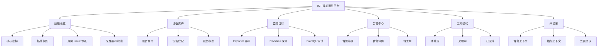
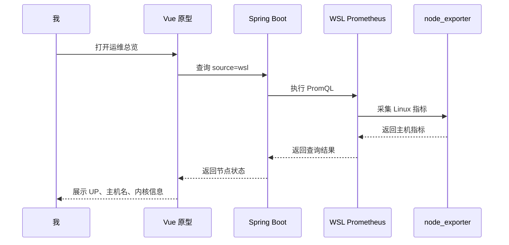
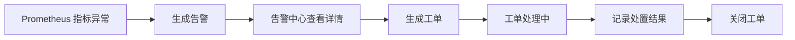
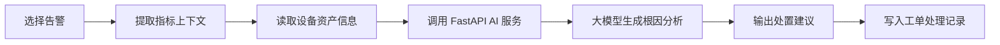

# 原型设计说明

## 一、原型设计目标

本阶段我将系统原型定位为“企业 ICT 运维工作台”，重点验证系统的信息架构、核心页面布局和主要业务流程。原型不做营销式首页，而是直接呈现运维人员进入系统后最常用的功能界面。

原型设计目标：

1. 展示真实运维平台的模块结构。
2. 保留 Prometheus 与 WSL Linux 节点的真实采集数据入口。
3. 明确设备、监控、告警、工单、AI 诊断之间的业务关系。
4. 为后续数据库设计、接口设计和功能开发提供页面依据。

## 二、原型范围

当前原型覆盖以下模块：

| 模块 | 原型内容 |
|---|---|
| 运维总览 | 核心指标、拓扑视图、真实 Linux 节点信息、采集目标状态、活跃告警 |
| 设备资产 | 设备资产表、状态筛选、关键字搜索、登记设备入口 |
| 监控目标 | 采集目标列表、采集方式、采集地址、PromQL 查询调试 |
| 告警中心 | 告警等级筛选、告警列表、生成工单入口 |
| 工单流转 | 待处理、处理中、已完成三列看板 |
| AI 诊断 | 故障上下文输入、诊断建议步骤原型 |

## 三、信息架构



## 四、页面布局设计

### 4.1 整体布局

采用后台系统常见的左右布局：

1. 左侧为固定模块导航。
2. 右侧为当前模块工作区。
3. 顶部显示当前页面标题、后端状态和刷新按钮。
4. 内容区采用指标卡片、表格、看板和诊断面板组合。

这种布局适合运维系统的高频操作场景，便于在多个模块之间快速切换。

### 4.2 运维总览

总览页用于集中展示系统状态：

1. 后端服务状态。
2. Docker 观测目标数量。
3. WSL 真实 Linux 节点状态。
4. 活跃告警数量。
5. Vue、Spring Boot、Prometheus、WSL、AI Service 的拓扑关系。
6. 最近活跃告警。
7. Prometheus 采集目标状态。

其中 WSL Linux 节点信息来自真实采集链路：

```text
node_exporter -> WSL Prometheus -> Spring Boot -> Vue
```

### 4.3 设备资产

设备资产页用于管理纳入运维范围的对象。当前原型字段包括：

1. 设备名称。
2. 设备类型。
3. IP 地址。
4. 所在位置。
5. 负责人。
6. 设备状态。

后续可以扩展字段：

1. 设备厂商。
2. 序列号。
3. 业务系统。
4. 监控模板。
5. 维保到期时间。

### 4.4 监控目标

监控目标页用于展示系统如何采集数据，当前包括：

1. Prometheus 自监控。
2. Docker node_exporter。
3. WSL Ubuntu node_exporter。
4. 后端 HTTP 探测。
5. 前端 HTTP 探测。

页面保留 PromQL 查询调试区，便于开发和演示时验证真实指标。

### 4.5 告警中心

告警中心用于承载监控指标到运维动作的转换。当前原型包含：

1. 严重、警告、提示三个等级。
2. 告警对象。
3. 发生时间。
4. 告警描述。
5. 生成工单入口。

后续功能实现时，告警来源可以分为：

1. Prometheus 指标规则。
2. Blackbox 可用性探测。
3. 人工录入。
4. AI 服务识别出的异常模式。

### 4.6 工单流转

工单页采用看板形式，分为：

1. 待处理。
2. 处理中。
3. 已完成。

这个设计用于体现从告警到处置闭环的过程，后续可以补充：

1. SLA 倒计时。
2. 处理人。
3. 处置记录。
4. 附件和截图。
5. 关闭原因。

### 4.7 AI 诊断

AI 诊断页用于后续接入 FastAPI 与大模型 API。当前原型包含：

1. 故障上下文输入框。
2. 诊断建议步骤。
3. 待接入大模型状态提示。

后续计划将以下数据作为 AI 输入：

1. 告警标题与等级。
2. Prometheus 指标片段。
3. 设备资产信息。
4. 历史工单。
5. 知识库文档。

## 五、主要交互流程

### 5.1 查看真实节点状态



### 5.2 告警转工单



### 5.3 AI 辅助诊断



## 六、当前原型文件

| 文件 | 说明 |
|---|---|
| `frontend/src/App.vue` | Vue 原型主页面 |
| `frontend/src/style.css` | 原型样式 |
| `docs/原型设计说明.md` | 原型设计文档 |

## 七、后续原型迭代计划

1. 将静态资产数据改为后端接口返回。
2. 增加设备详情抽屉或详情页。
3. 增加告警详情弹窗。
4. 增加工单创建表单。
5. 增加 AI 诊断结果落库与转工单功能。
6. 增加 ECharts 指标趋势图。
