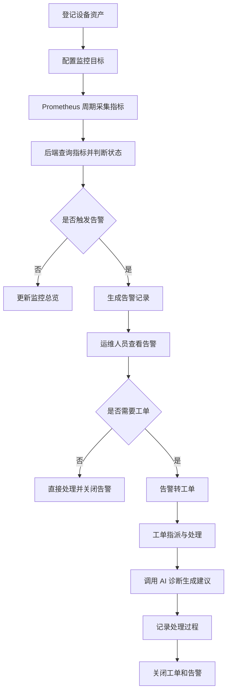
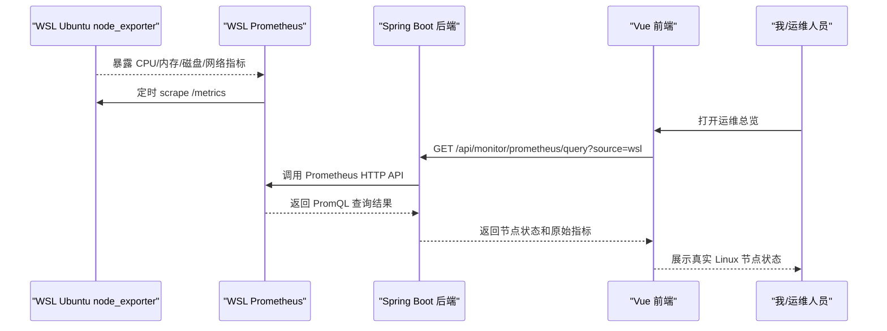
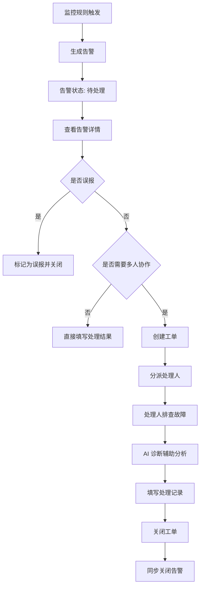
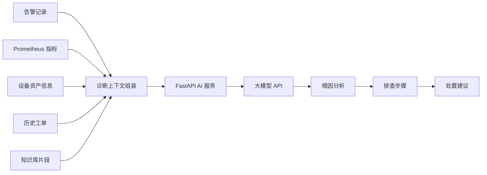
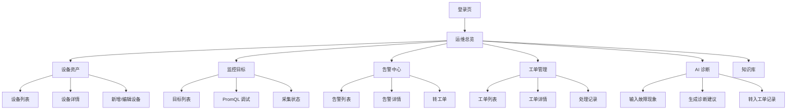

# 原型与流程设计说明书

## 一、设计目标

在正式进入功能开发前，我先完成系统原型、业务流程和 UML 设计。本阶段的目标是明确系统边界、页面结构、核心业务闭环和主要对象关系，避免后续直接写代码时模块边界混乱。

本项目的设计重点包括：

1. 明确 ICT 智能运维平台的核心使用角色。
2. 明确设备资产、监控目标、告警、工单、AI 诊断之间的业务关系。
3. 明确真实 Linux 节点、Prometheus、后端、前端之间的数据流。
4. 明确主要页面原型与交互入口。
5. 为后续数据库设计、接口设计和代码实现提供依据。

## 二、角色设计

| 角色 | 职责 |
|---|---|
| 系统管理员 | 管理用户、角色、权限、基础配置 |
| 运维主管 | 查看总览、审核告警、分派工单、查看统计 |
| 运维人员 | 管理设备、处理告警、执行工单、使用 AI 诊断 |
| 普通查看人员 | 查看知识库、查看部分监控信息 |
| AI 服务 | 负责日志分析、故障诊断、知识库问答 |

## 三、核心模块设计

| 模块 | 说明 |
|---|---|
| 运维总览 | 展示设备数量、告警数量、节点状态、采集目标状态 |
| 设备资产 | 管理服务器、网络设备、服务组件等运维对象 |
| 监控目标 | 管理 Prometheus、Exporter、Blackbox 探测目标 |
| 告警中心 | 展示告警列表、告警详情、告警状态流转 |
| 工单管理 | 将告警转为工单，完成指派、处理、关闭 |
| AI 诊断 | 根据告警、指标和知识库生成故障分析建议 |
| 知识库 | 保存运维文档、故障手册、处理经验 |

## 四、总体业务流程

## 五、真实节点采集流程

## 六、告警转工单流程

## 七、AI 故障诊断流程

## 八、页面原型结构

## 九、原型页面清单

| 页面 | 主要内容 | 关键操作 |
|---|---|---|
| 登录页 | 账号、密码、登录按钮 | 登录系统 |
| 运维总览 | 指标卡片、拓扑、告警摘要、采集状态 | 刷新、跳转详情 |
| 设备资产页 | 设备表格、筛选条件、状态标签 | 新增、编辑、查看详情 |
| 监控目标页 | 采集目标表、PromQL 调试 | 新增目标、测试查询 |
| 告警中心页 | 告警列表、等级筛选、状态筛选 | 查看详情、确认、转工单 |
| 工单管理页 | 工单看板、处理记录 | 指派、处理、关闭 |
| AI 诊断页 | 故障输入、指标上下文、诊断结果 | 生成建议、写入工单 |
| 知识库页 | 文档列表、问答窗口、引用来源 | 上传文档、提问 |

## 十、设计优先级

第一阶段优先完成：

1. 运维总览。
2. 设备资产。
3. 监控目标。
4. 告警中心。

第二阶段继续完成：

1. 工单管理。
2. AI 诊断。
3. 知识库问答。
4. 指标趋势图和统计分析。
